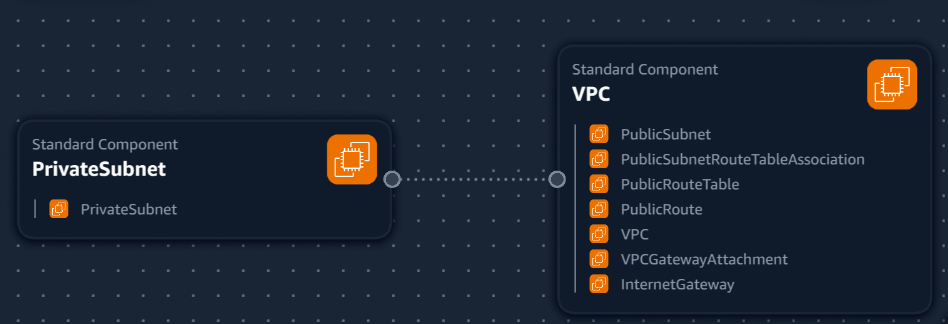
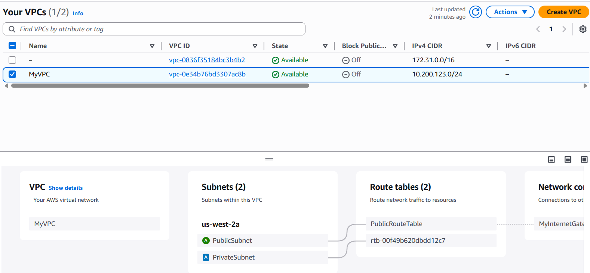

## VPC Settings

These are the VPC Settings we ovserved Tim setup for our cloud environment in AWS:

- VPC IPv4 CIDR Block: 10.200.123.0/24
- Ipv6 CIDR block: no
- Number of azs: 1
- Number of public subnets: 1
- Number pr private subnets: 1
- NAT GATEWAYS: None
- VPC Endpoints: None
- DNS Options: Enable DNS Hostnames
- DNC Options: Enable DNS Resolution

## Generated and Review CFN Template

watching the instructure's videos, I noted the VPC Setting, provided this to LLM to produce the CFN template to automate the provision of the VPC infrastructure.

I had to ask the LLM to refactor the parameters so that it would not hard code values and the template is more reusable.

## Generated Deploy Script

Using ChatGPT generated a bash script `bin/deploy` 

I changed the shebang to work for all OS platforms.

## Visulization in Infrastructure Composer

I thought maybe we could visulize our VPC via Infrastructure Composer but its not the best representation.

## Installing AWS CLI

In order to deploy via the AWS CLI, we need to install it. 

We follow the install instructions: https://docs.aws.amazon.com/cli/latest/userguide/getting-started-install.html

## Deploy Resource to AWS

This is the resource of the map of VPC deployed with CFN.
