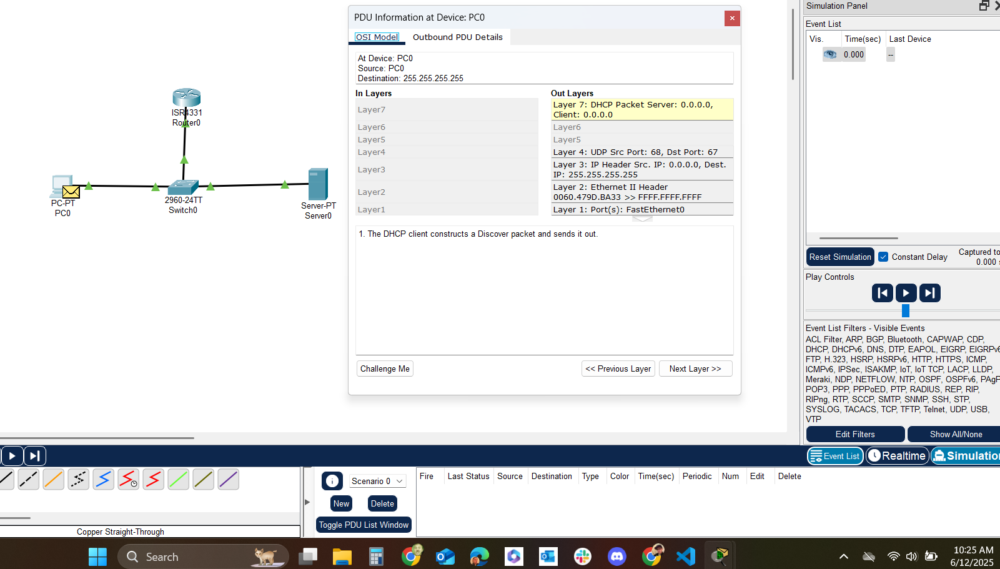

# State of the Network

While exploring the Packet Tracer I simulated a network that request an IP address from the DHCP server and gets a response with with and IP address.

I'm still learning and this is my first time using Packet Tracer. I do know that we set up the PC, switch, router and server. The PC sending a broadcast requesting an IP. The request in approved and the IP is sent.